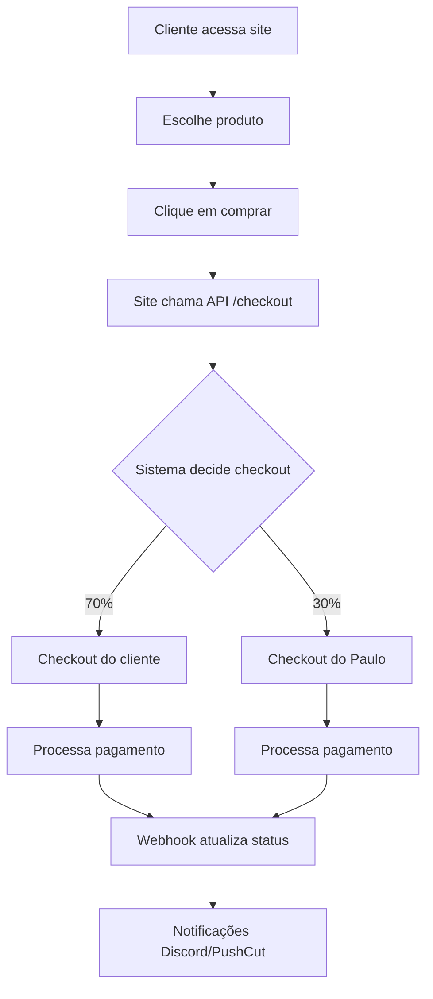

# 🛒 GUIA COMPLETO: CHECKOUT NO SITE DO CLIENTE

## 🎯 **COMO FUNCIONA O SISTEMA DE CHECKOUT**

### **1. FLUXO COMPLETO DO CHECKOUT**



### **2. SISTEMA DE ROTAÇÃO 7x3**

#### **Lógica do Checkout:**
- **70%** das vendas vão para o **checkout do cliente**
- **30%** das vendas vão para o **checkout do Paulo**
- **Contagem**: Por oferta (cada produto tem sua contagem)

#### **Código da Lógica:**
```typescript
const cycle = totalSales % 10;
if (cycle === 7 || cycle === 8 || cycle === 6) {
  // 30% vão para o Paulo
  checkoutToUse = chk.myCheckout === "no-use" ? checkout : chk.myCheckout;
} else {
  // 70% vão para o cliente
  checkoutToUse = checkout;
}
```

## 🔧 **CONFIGURAÇÃO NO SITE DO CLIENTE**

### **1. INTEGRAÇÃO BÁSICA**

#### **JavaScript no Site do Cliente:**
```javascript
// Função para obter checkout
async function getCheckout(offerName, clientCheckout) {
  try {
    const response = await fetch('https://sua-api-pix.com/checkout', {
      method: 'POST',
      headers: {
        'Content-Type': 'application/json',
      },
      body: JSON.stringify({
        checkout: clientCheckout,  // URL do checkout do cliente
        offer: offerName          // Nome da oferta/produto
      })
    });
    
    const data = await response.json();
    return data.checkout; // URL do checkout a ser usado
  } catch (error) {
    console.error('Erro ao obter checkout:', error);
    return clientCheckout; // Fallback para checkout do cliente
  }
}

// Exemplo de uso
const checkoutUrl = await getCheckout('Pix do Milhão', 'https://meusite.com/checkout');
window.location.href = checkoutUrl;
```

#### **HTML no Site do Cliente:**
```html
<button onclick="comprarProduto()">Comprar Agora</button>

<script>
async function comprarProduto() {
  const checkoutUrl = await getCheckout('Pix do Milhão', 'https://meusite.com/checkout');
  window.location.href = checkoutUrl;
}
</script>
```

### **2. INTEGRAÇÃO COM GATEWAYS DE PAGAMENTO**

#### **Para BlackCat (Gateway do Paulo):**
```javascript
// Quando o checkout for do Paulo (BlackCat)
async function processarPagamentoBlackCat(dadosCliente) {
  const response = await fetch('https://sua-api-pix.com/gerarpix', {
    method: 'POST',
    headers: {
      'Content-Type': 'application/json',
    },
    body: JSON.stringify({
      credentials: {
        token: 'token-do-cliente',
        name: 'Nome do Cliente'
      },
      amount: dadosCliente.valor,
      product: {
        title: dadosCliente.produto
      },
      customer: {
        name: dadosCliente.nome,
        email: dadosCliente.email,
        phone: dadosCliente.telefone,
        document: {
          type: 'CPF',
          number: dadosCliente.cpf
        }
      }
    })
  });
  
  const pixData = await response.json();
  // Redirecionar para página de pagamento PIX
  window.location.href = pixData.payment_url;
}
```

#### **Para Gateway do Cliente:**
```javascript
// Quando o checkout for do cliente
async function processarPagamentoCliente(dadosCliente) {
  // Usar gateway do cliente (ex: PagSeguro, Mercado Pago, etc.)
  const response = await fetch('https://api-cliente.com/pagamentos', {
    method: 'POST',
    headers: {
      'Authorization': 'Bearer token-do-cliente',
      'Content-Type': 'application/json',
    },
    body: JSON.stringify({
      amount: dadosCliente.valor,
      customer: dadosCliente,
      // ... outros campos do gateway do cliente
    })
  });
  
  const paymentData = await response.json();
  // Redirecionar para página de pagamento
  window.location.href = paymentData.checkout_url;
}
```

## 📋 **CONFIGURAÇÃO NECESSÁRIA**

### **1. NO SITE DO CLIENTE**

#### **A. Configurar URLs da API:**
```javascript
const API_CONFIG = {
  baseUrl: 'https://sua-api-pix.com',
  endpoints: {
    checkout: '/checkout',
    pagamento: '/gerarpix',
    webhook: '/webhook-blackcat'
  }
};
```

#### **B. Configurar Tokens:**
```javascript
const CLIENT_CONFIG = {
  token: 'token-do-cliente',
  name: 'Nome do Cliente',
  checkoutUrl: 'https://meusite.com/checkout'
};
```

#### **C. Configurar Ofertas:**
```javascript
const OFFERS = {
  'Pix do Milhão': {
    price: 97,
    checkoutUrl: 'https://meusite.com/checkout-pix-milhao'
  },
  'Ebook Marketing': {
    price: 47,
    checkoutUrl: 'https://meusite.com/checkout-ebook'
  }
};
```

### **2. NA API DO PAULO**

#### **A. Configurar Checkout do Paulo:**
```bash
# Atualizar checkout para uma oferta
curl -X POST https://sua-api-pix.com/checkout/update \
  -H "Content-Type: application/json" \
  -d '{
    "checkout": "https://checkout-paulo.com/pix-milhao",
    "offer": "Pix do Milhão"
  }'
```

#### **B. Verificar Checkouts Configurados:**
```bash
# Listar todos os checkouts
curl -X GET https://sua-api-pix.com/checkout
```

## 🔄 **FLUXO DETALHADO**

### **1. CLIENTE ACESSA O SITE**
- Cliente vê o produto
- Clica em "Comprar Agora"

### **2. SITE CHAMA API DE CHECKOUT**
```javascript
// Site do cliente faz requisição
const response = await fetch('https://sua-api-pix.com/checkout', {
  method: 'POST',
  body: JSON.stringify({
    checkout: 'https://meusite.com/checkout',
    offer: 'Pix do Milhão'
  })
});

const { checkout } = await response.json();
// checkout será 'https://meusite.com/checkout' ou 'https://checkout-paulo.com/pix-milhao'
```

### **3. SISTEMA DECIDE O CHECKOUT**
- **70%** das vezes: Retorna checkout do cliente
- **30%** das vezes: Retorna checkout do Paulo

### **4. PROCESSAMENTO DO PAGAMENTO**

#### **Se for checkout do cliente:**
- Site processa com gateway do cliente
- Cliente recebe 100% da venda

#### **Se for checkout do Paulo:**
- Site chama API `/gerarpix`
- Sistema 7x3 decide gateway:
  - **70%**: Gateway do cliente
  - **30%**: BlackCat (Paulo)

### **5. WEBHOOK ATUALIZA STATUS**
- Gateway envia webhook para `/webhook-blackcat`
- Status da venda é atualizado no banco
- Notificações são enviadas (Discord, PushCut)

## ⚠️ **PONTOS IMPORTANTES**

### **1. CONFIGURAÇÃO OBRIGATÓRIA**
- ✅ **Checkout do cliente** deve estar configurado
- ✅ **Checkout do Paulo** deve estar configurado
- ✅ **Tokens** devem estar corretos
- ✅ **Webhooks** devem estar configurados

### **2. TESTES NECESSÁRIOS**
- ✅ Testar rotação 7x3
- ✅ Testar checkout do cliente
- ✅ Testar checkout do Paulo
- ✅ Testar webhooks
- ✅ Testar notificações

### **3. MONITORAMENTO**
- ✅ Logs de vendas
- ✅ Notificações Discord
- ✅ Notificações PushCut
- ✅ Status das vendas

## 🚀 **EXEMPLO COMPLETO**

### **HTML do Site do Cliente:**
```html
<!DOCTYPE html>
<html>
<head>
    <title>Loja do Cliente</title>
</head>
<body>
    <div class="produto">
        <h2>Pix do Milhão</h2>
        <p>R$ 97,00</p>
        <button onclick="comprar()">Comprar Agora</button>
    </div>

    <script>
        async function comprar() {
            try {
                // 1. Obter checkout
                const checkoutUrl = await getCheckout('Pix do Milhão', 'https://meusite.com/checkout');
                
                // 2. Redirecionar para checkout
                window.location.href = checkoutUrl;
            } catch (error) {
                console.error('Erro ao processar compra:', error);
                alert('Erro ao processar compra. Tente novamente.');
            }
        }

        async function getCheckout(offer, clientCheckout) {
            const response = await fetch('https://sua-api-pix.com/checkout', {
                method: 'POST',
                headers: { 'Content-Type': 'application/json' },
                body: JSON.stringify({ checkout: clientCheckout, offer })
            });
            
            const data = await response.json();
            return data.checkout;
        }
    </script>
</body>
</html>
```

## ✅ **CHECKLIST DE IMPLEMENTAÇÃO**

- [ ] Site do cliente configurado
- [ ] API de checkout funcionando
- [ ] Checkout do Paulo configurado
- [ ] Tokens corretos
- [ ] Webhooks configurados
- [ ] Testes realizados
- [ ] Monitoramento ativo

## 🆘 **PROBLEMAS COMUNS**

### **Erro 500 no checkout**
- Verificar se a oferta existe
- Verificar se o checkout está configurado
- Verificar logs da API

### **Checkout sempre do cliente**
- Verificar lógica de rotação
- Verificar contagem de vendas
- Verificar configuração do checkout do Paulo

### **Webhook não funciona**
- Verificar URL do webhook
- Verificar formato dos dados
- Verificar logs do webhook

---

**Agora você tem tudo configurado para o checkout funcionar perfeitamente! 🚀**


