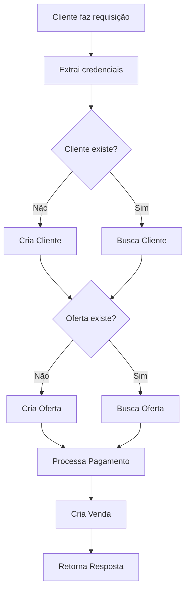

# 🔐 GUIA COMPLETO: CREDENCIAIS E BANCO DE DADOS

## 🎯 **COMO FUNCIONAM AS CREDENCIAIS**

### **1. ESTRUTURA DAS CREDENCIAIS**

#### **A. Credenciais do Cliente (Enviadas na Requisição):**
```typescript
interface CreatePixBody {
  credentials: {
    token: string;        // Token do cliente (secret key)
    name: string;         // Nome do cliente
    organizationId?: string; // ID da organização (opcional)
    offer: {              // Informações da oferta (opcional)
      id: string;
      name: string;
    };
  };
  // ... outros dados
}
```

#### **B. Credenciais do Paulo (Configuradas na API):**
```typescript
// src/models/api.ts
export const credentials = {
  secret: "sk_3vbubUgktoXLnTUWVcWixEig2oNelGYXEaiC-S9et8yDhUGl", // Secret Key BlackCat
  public: "pk_kFHKtjIthC9PhGDuInP_GAoxqSzY1LKkeXxj9YCmvMgJPHOH",  // Public Key BlackCat
};
```

### **2. COMO O SISTEMA PEGA AS CREDENCIAIS**

#### **A. Do Cliente (Via Requisição):**
```javascript
// Cliente envia na requisição
const response = await fetch('https://sua-api-pix.com/gerarpix', {
  method: 'POST',
  headers: { 'Content-Type': 'application/json' },
  body: JSON.stringify({
    credentials: {
      token: 'sk_cliente_123',  // Secret key do cliente
      name: 'João Silva'        // Nome do cliente
    },
    // ... outros dados
  })
});
```

#### **B. Do Paulo (Configuradas no Código):**
```typescript
// Sistema usa automaticamente
import { credentials as myCredentials } from "../models/api";

// Usa as credenciais do Paulo
const tokenToUse = myCredentials.secret; // Secret key do Paulo
```

## 🗄️ **COMO SÃO CRIADOS OS DADOS NO BANCO**

### **1. FLUXO DE CRIAÇÃO DE DADOS**



### **2. CRIAÇÃO AUTOMÁTICA DE CLIENTES**

#### **A. Verificação e Criação:**
```typescript
// 1️⃣ Busca cliente pelo token
let client = await prisma.client.findUnique({
  where: { token: clientToken },
});

// 2️⃣ Se não existir, cria automaticamente
if (!client) {
  client = await prisma.client.create({
    data: {
      name: data.credentials.name,     // Nome enviado pelo cliente
      token: clientToken,              // Token enviado pelo cliente
      useTax: false,                  // Padrão: false
    },
  });
}
```

#### **B. Dados Salvos na Tabela Client:**
```sql
-- Tabela: Client
INSERT INTO "Client" (
  id,                    -- UUID gerado automaticamente
  name,                  -- Nome do cliente (data.credentials.name)
  token,                 -- Token do cliente (data.credentials.token)
  "useTax",              -- false (padrão)
  "createdAt"            -- Data atual
) VALUES (
  gen_random_uuid(),
  'João Silva',
  'sk_cliente_123',
  false,
  NOW()
);
```

### **3. CRIAÇÃO AUTOMÁTICA DE OFERTAS**

#### **A. Lógica de Criação:**
```typescript
// 1️⃣ Se oferta foi enviada explicitamente
if (offerInfo && offerInfo.id && offerInfo.name) {
  offer = await prisma.offer.findUnique({ where: { id: offerInfo.id } });
  if (!offer) {
    offer = await prisma.offer.create({
      data: {
        id: offerInfo.id,
        name: offerInfo.name,
        useTax: false,
        clientId: client.id,
      },
    });
  }
} else {
  // 2️⃣ Se não, infere pelo nome do produto
  const normalized = productName.toLowerCase();
  let inferredName = "";
  
  if (normalized.includes("ebook")) inferredName = "Pix do Milhão";
  else if (normalized.includes("jibbitz")) inferredName = "Crocs";
  else if (normalized.includes("bracelete")) inferredName = "Pandora";
  else if (normalized.includes("kit labial")) inferredName = "Sephora";
  else inferredName = "Oferta Padrão";
  
  // Busca ou cria a oferta inferida
  offer = await prisma.offer.findFirst({
    where: { name: inferredName, clientId: client.id },
  });
  
  if (!offer) {
    offer = await prisma.offer.create({
      data: {
        name: inferredName,
        useTax: false,
        clientId: client.id,
      },
    });
  }
}
```

#### **B. Dados Salvos na Tabela Offer:**
```sql
-- Tabela: Offer
INSERT INTO "Offer" (
  id,                    -- UUID gerado automaticamente
  name,                  -- Nome da oferta (inferido ou enviado)
  "useTax",              -- false (padrão)
  "clientId",            -- ID do cliente
  "createdAt"            -- Data atual
) VALUES (
  gen_random_uuid(),
  'Pix do Milhão',
  false,
  'client-uuid-here',
  NOW()
);
```

### **4. CRIAÇÃO DE VENDAS**

#### **A. Após Processar Pagamento:**
```typescript
// Cria a venda no banco
await prisma.sale.create({
  data: {
    amount: data.amount,                    // Valor da venda
    ghostId: `${responseJson.id}`,         // ID da transação no gateway
    approved: false,                       // Status inicial: não aprovada
    customerName: data.customer.name,      // Nome do cliente
    productName: data.product.title,       // Nome do produto
    visible: true,                         // Visível: true
    toClient,                              // true se vai para cliente, false se vai para Paulo
    clientId: client.id,                   // ID do cliente
    offerId: offer.id,                     // ID da oferta
  },
});
```

#### **B. Dados Salvos na Tabela Sale:**
```sql
-- Tabela: Sale
INSERT INTO "Sale" (
  id,                    -- UUID gerado automaticamente
  "ghostId",             -- ID da transação no gateway
  approved,              -- false (inicial)
  "productName",         -- Nome do produto
  "customerName",        -- Nome do cliente
  visible,               -- true
  amount,                -- Valor da venda
  "toClient",            -- true/false (sistema 7x3)
  "clientId",            -- ID do cliente
  "offerId",             -- ID da oferta
  "createdAt"            -- Data atual
) VALUES (
  gen_random_uuid(),
  'tx_123456789',
  false,
  'Pix do Milhão',
  'João Silva',
  true,
  97.00,
  true,
  'client-uuid-here',
  'offer-uuid-here',
  NOW()
);
```

## 🔄 **SISTEMA DE ROTAÇÃO 7x3**

### **1. LÓGICA DE DECISÃO**

```typescript
// Conta vendas da oferta
const totalSales = await prisma.sale.count({
  where: { offerId: offer.id },
});

const nextCount = totalSales + 1;
const cycle = nextCount % 10;

// Sistema 7x3
if (cycle < 7) {
  // 70% - Vai para o cliente
  tokenToUse = clientToken;        // Usa token do cliente
  toClient = true;                 // Marca como venda do cliente
} else {
  // 30% - Vai para o Paulo
  tokenToUse = myCredentials.secret; // Usa token do Paulo
  toClient = false;                // Marca como venda do Paulo
}
```

### **2. EXEMPLO PRÁTICO**

```
Venda #1: cycle = 1 % 10 = 1 → < 7 → Cliente (70%)
Venda #2: cycle = 2 % 10 = 2 → < 7 → Cliente (70%)
Venda #3: cycle = 3 % 10 = 3 → < 7 → Cliente (70%)
Venda #4: cycle = 4 % 10 = 4 → < 7 → Cliente (70%)
Venda #5: cycle = 5 % 10 = 5 → < 7 → Cliente (70%)
Venda #6: cycle = 6 % 10 = 6 → < 7 → Cliente (70%)
Venda #7: cycle = 7 % 10 = 7 → >= 7 → Paulo (30%)
Venda #8: cycle = 8 % 10 = 8 → >= 7 → Paulo (30%)
Venda #9: cycle = 9 % 10 = 9 → >= 7 → Paulo (30%)
Venda #10: cycle = 10 % 10 = 0 → < 7 → Cliente (70%)
```

## 📊 **ESTRUTURA COMPLETA DO BANCO**

### **1. TABELA CLIENT**
```sql
CREATE TABLE "Client" (
  id          TEXT PRIMARY KEY DEFAULT gen_random_uuid(),
  name        TEXT NOT NULL,
  description TEXT,
  token       TEXT UNIQUE NOT NULL,  -- Secret key do cliente
  "useTax"    BOOLEAN DEFAULT false,
  "createdAt" TIMESTAMP DEFAULT NOW(),
  sales       "Sale"[],
  offers      "Offer"[]
);
```

### **2. TABELA OFFER**
```sql
CREATE TABLE "Offer" (
  id          TEXT PRIMARY KEY DEFAULT gen_random_uuid(),
  name        TEXT NOT NULL,
  description TEXT,
  "useTax"    BOOLEAN DEFAULT false,
  "createdAt" TIMESTAMP DEFAULT NOW(),
  "clientId"  TEXT NOT NULL REFERENCES "Client"(id),
  sales       "Sale"[]
);
```

### **3. TABELA SALE**
```sql
CREATE TABLE "Sale" (
  id           TEXT PRIMARY KEY DEFAULT gen_random_uuid(),
  "ghostId"    TEXT UNIQUE NOT NULL,  -- ID da transação no gateway
  approved     BOOLEAN DEFAULT false,
  "productName" TEXT NOT NULL,
  "customerName" TEXT NOT NULL,
  visible      BOOLEAN,
  amount       DOUBLE PRECISION NOT NULL,
  "toClient"   BOOLEAN NOT NULL,      -- true = cliente, false = Paulo
  "createdAt"  TIMESTAMP DEFAULT NOW(),
  "clientId"   TEXT NOT NULL REFERENCES "Client"(id),
  "offerId"    TEXT REFERENCES "Offer"(id)
);
```

### **4. TABELA CHECKOUT**
```sql
CREATE TABLE "Checkout" (
  id                 TEXT PRIMARY KEY DEFAULT gen_random_uuid(),
  "myCheckout"       TEXT NOT NULL,      -- Checkout do Paulo
  offer              TEXT UNIQUE,        -- Nome da oferta
  "lastClientCheckout" TEXT,             -- Último checkout do cliente
  "updatedAt"        TIMESTAMP DEFAULT NOW(),
  "createdAt"        TIMESTAMP DEFAULT NOW()
);
```

## 🔍 **EXEMPLO COMPLETO DE UMA VENDA**

### **1. REQUISIÇÃO DO CLIENTE:**
```javascript
const response = await fetch('https://sua-api-pix.com/gerarpix', {
  method: 'POST',
  headers: { 'Content-Type': 'application/json' },
  body: JSON.stringify({
    credentials: {
      token: 'sk_cliente_123',           // Secret key do cliente
      name: 'João Silva'                 // Nome do cliente
    },
    amount: 97,
    product: {
      title: 'Pix do Milhão'
    },
    customer: {
      name: 'Maria Santos',
      email: 'maria@email.com',
      phone: '11999999999',
      document: {
        type: 'CPF',
        number: '12345678901'
      }
    }
  })
});
```

### **2. DADOS CRIADOS NO BANCO:**

#### **A. Cliente (se não existir):**
```sql
INSERT INTO "Client" VALUES (
  'uuid-123',
  'João Silva',
  NULL,
  'sk_cliente_123',
  false,
  NOW()
);
```

#### **B. Oferta (inferida pelo produto):**
```sql
INSERT INTO "Offer" VALUES (
  'uuid-456',
  'Pix do Milhão',
  NULL,
  false,
  NOW(),
  'uuid-123'  -- clientId
);
```

#### **C. Venda:**
```sql
INSERT INTO "Sale" VALUES (
  'uuid-789',
  'tx_blackcat_123',
  false,
  'Pix do Milhão',
  'Maria Santos',
  true,
  97.00,
  true,        -- toClient (sistema 7x3)
  'uuid-123',  -- clientId
  'uuid-456',  -- offerId
  NOW()
);
```

## ⚠️ **PONTOS IMPORTANTES**

### **1. CREDENCIAIS DO CLIENTE**
- ✅ **Token**: Secret key do gateway do cliente
- ✅ **Nome**: Nome do cliente (para identificação)
- ✅ **Oferta**: Opcional (pode ser inferida pelo produto)

### **2. CRIAÇÃO AUTOMÁTICA**
- ✅ **Cliente**: Criado automaticamente na primeira venda
- ✅ **Oferta**: Criada automaticamente (inferida ou enviada)
- ✅ **Venda**: Criada após processar pagamento

### **3. SISTEMA 7x3**
- ✅ **70%**: Vendas vão para o cliente
- ✅ **30%**: Vendas vão para o Paulo
- ✅ **Contagem**: Por oferta (cada produto tem sua contagem)

### **4. SEGURANÇA**
- ✅ **Tokens**: Armazenados de forma segura
- ✅ **Validação**: Tokens são validados antes do uso
- ✅ **Logs**: Todas as operações são logadas

---

**Agora você entende como funcionam as credenciais e a criação de dados no banco! 🚀**

