# 🚀 GUIA COMPLETO: CONFIGURAR NOVA OFERTA

## 🎯 **RESPOSTA DIRETA**

### **1. COMO CONFIGURAR UMA NOVA OFERTA:**
- ✅ **Checkout**: Configure via API `/checkout/update`
- ✅ **useTax**: Configure via API `/use-tax` (para receber vendas)
- ✅ **Cliente**: Criado automaticamente na primeira venda

### **2. COMO O SISTEMA ENCONTRA AS CREDENCIAIS:**
- ✅ **Cliente envia** suas credenciais na requisição
- ✅ **Sistema cria** cliente automaticamente
- ✅ **Sistema usa** credenciais do cliente para processar pagamentos

## 🔧 **PASSO A PASSO PARA CONFIGURAR NOVA OFERTA**

### **1. CONFIGURAR CHECKOUT DO PAULO**

```bash
# Configurar checkout para sua nova oferta
curl -X POST https://sua-api-pix.com/checkout/update \
  -H "Content-Type: application/json" \
  -d '{
    "checkout": "https://checkout-paulo.com/nova-oferta",
    "offer": "Nova Oferta"
  }'
```

### **2. CONFIGURAR useTax (PARA RECEBER VENDAS)**

```bash
# Primeiro, obter o ID da oferta
curl -X GET https://sua-api-pix.com/clients

# Depois, alterar useTax para true
curl -X POST https://sua-api-pix.com/use-tax \
  -H "Content-Type: application/json" \
  -d '{
    "offerId": "uuid-da-oferta",
    "useTax": true
  }'
```

### **3. CLIENTE INTEGRA COM SUA API**

```javascript
// No site do cliente
const response = await fetch('https://sua-api-pix.com/gerarpix', {
  method: 'POST',
  headers: { 'Content-Type': 'application/json' },
  body: JSON.stringify({
    credentials: {
      token: 'sk_cliente_123',        // Secret key do cliente
      name: 'Nome do Cliente'         // Nome do cliente
    },
    amount: 100,
    product: {
      title: 'Nova Oferta'            // Nome da oferta
    },
    customer: {
      name: 'João Silva',
      email: 'joao@email.com',
      phone: '11999999999',
      document: {
        type: 'CPF',
        number: '12345678901'
      }
    }
  })
});
```

## 🔍 **COMO O SISTEMA ENCONTRA AS CREDENCIAIS**

### **1. FLUXO AUTOMÁTICO:**

```mermaid
graph TD
    A[Cliente faz requisição] --> B[Extrai credenciais da requisição]
    B --> C{Cliente existe?}
    C -->|Não| D[Cria cliente automaticamente]
    C -->|Sim| E[Busca cliente existente]
    D --> F[Usa credenciais do cliente]
    E --> F
    F --> G[Processa pagamento]
```



### **2. CREDENCIAIS SÃO ENVIADAS PELO CLIENTE:**

```typescript
// Cliente envia na requisição
{
  credentials: {
    token: 'sk_cliente_123',        // Secret key do gateway do cliente
    name: 'Nome do Cliente'         // Nome para identificação
  },
  // ... outros dados
}
```

### **3. SISTEMA CRIA CLIENTE AUTOMATICAMENTE:**

```typescript
// Sistema busca cliente pelo token
let client = await prisma.client.findUnique({
  where: { token: clientToken },
});

// Se não existir, cria automaticamente
if (!client) {
  client = await prisma.client.create({
    data: {
      name: data.credentials.name,     // Nome enviado pelo cliente
      token: clientToken,              // Token enviado pelo cliente
      useTax: false,                  // Padrão: false
    },
  });
}
```

## 📋 **CONFIGURAÇÃO COMPLETA DA NOVA OFERTA**

### **1. CONFIGURAR CHECKOUT (OBRIGATÓRIO)**

```bash
# Configurar checkout do Paulo para a nova oferta
curl -X POST https://sua-api-pix.com/checkout/update \
  -H "Content-Type: application/json" \
  -d '{
    "checkout": "https://checkout-paulo.com/nova-oferta",
    "offer": "Nova Oferta"
  }'
```

### **2. CONFIGURAR useTax (PARA RECEBER VENDAS)**

```bash
# Obter ID da oferta
curl -X GET https://sua-api-pix.com/clients

# Alterar useTax para true
curl -X POST https://sua-api-pix.com/use-tax \
  -H "Content-Type: application/json" \
  -d '{
    "offerId": "uuid-da-oferta",
    "useTax": true
  }'
```

### **3. CLIENTE CONFIGURA NO SITE**

```javascript
// Configuração no site do cliente
const CLIENT_CONFIG = {
  credentials: {
    token: 'sk_cliente_123',        // Secret key do gateway do cliente
    name: 'Nome do Cliente'         // Nome do cliente
  },
  api: {
    baseUrl: 'https://sua-api-pix.com',
    endpoints: {
      gerarpix: '/gerarpix',
      checkout: '/checkout'
    }
  }
};

// Função para processar venda
async function processarVenda(dadosVenda) {
  // 1. Obter checkout (sistema 7x3)
  const checkoutUrl = await obterCheckout(dadosVenda.produto);
  
  // 2. Se for checkout do Paulo, processar com BlackCat
  if (checkoutUrl.includes('sua-api-pix.com')) {
    return await processarComBlackCat(dadosVenda);
  } else {
    // 3. Se for checkout do cliente, processar com gateway do cliente
    return await processarComGatewayCliente(dadosVenda, checkoutUrl);
  }
}
```

## 🔄 **SISTEMA DE ROTAÇÃO 7x3**

### **1. CHECKOUT (7x3):**
- **70%** → Checkout do cliente
- **30%** → Checkout do Paulo

### **2. PAGAMENTO (7x3):**
- **70%** → Gateway do cliente
- **30%** → BlackCat (Paulo)

### **3. COM useTax = true:**
- **70%** → Cliente recebe 100%
- **30%** → Paulo recebe 100%

## 📊 **EXEMPLO PRÁTICO COMPLETO**

### **1. CONFIGURAÇÃO INICIAL (Paulo):**

```bash
# 1. Configurar checkout
curl -X POST https://sua-api-pix.com/checkout/update \
  -H "Content-Type: application/json" \
  -d '{
    "checkout": "https://checkout-paulo.com/curso-marketing",
    "offer": "Curso de Marketing"
  }'

# 2. Obter ID da oferta
curl -X GET https://sua-api-pix.com/clients

# 3. Configurar useTax
curl -X POST https://sua-api-pix.com/use-tax \
  -H "Content-Type: application/json" \
  -d '{
    "offerId": "uuid-do-curso-marketing",
    "useTax": true
  }'
```

### **2. INTEGRAÇÃO NO SITE DO CLIENTE:**

```javascript
// Configuração do cliente
const CLIENT_CONFIG = {
  credentials: {
    token: 'sk_pagseguro_123',      // Secret key do PagSeguro
    name: 'João Silva'              // Nome do cliente
  },
  api: {
    baseUrl: 'https://sua-api-pix.com'
  }
};

// Processar venda
async function comprarCurso() {
  try {
    // 1. Obter checkout
    const checkoutUrl = await obterCheckout('Curso de Marketing');
    
    // 2. Processar pagamento
    if (checkoutUrl.includes('sua-api-pix.com')) {
      // Checkout do Paulo - usar BlackCat
      const response = await fetch('https://sua-api-pix.com/gerarpix', {
        method: 'POST',
        headers: { 'Content-Type': 'application/json' },
        body: JSON.stringify({
          credentials: {
            token: 'sk_pagseguro_123',
            name: 'João Silva'
          },
          amount: 297,
          product: { title: 'Curso de Marketing' },
          customer: {
            name: 'Maria Santos',
            email: 'maria@email.com',
            phone: '11999999999',
            document: {
              type: 'CPF',
              number: '12345678901'
            }
          }
        })
      });
      
      const pixData = await response.json();
      window.location.href = pixData.payment_url;
    } else {
      // Checkout do cliente - usar PagSeguro
      window.location.href = checkoutUrl;
    }
  } catch (error) {
    console.error('Erro ao processar venda:', error);
  }
}
```

## ⚠️ **PONTOS IMPORTANTES**

### **1. CREDENCIAIS DO CLIENTE:**
- ✅ **Cliente envia** suas credenciais na requisição
- ✅ **Sistema cria** cliente automaticamente
- ✅ **Não precisa** cadastrar cliente manualmente

### **2. CONFIGURAÇÃO OBRIGATÓRIA:**
- ✅ **Checkout do Paulo** deve estar configurado
- ✅ **useTax = true** para receber vendas
- ✅ **Cliente** deve enviar credenciais corretas

### **3. SISTEMA AUTOMÁTICO:**
- ✅ **Cliente**: Criado automaticamente
- ✅ **Oferta**: Criada automaticamente
- ✅ **Venda**: Criada automaticamente
- ✅ **Rotação**: 7x3 automática

## 🚀 **CHECKLIST DE CONFIGURAÇÃO**

- [ ] Checkout do Paulo configurado
- [ ] useTax configurado como true
- [ ] Cliente tem credenciais do gateway
- [ ] Cliente integra com sua API
- [ ] Testes realizados
- [ ] Monitoramento ativo

## 🆘 **PROBLEMAS COMUNS**

### **Cliente não é criado:**
- Verificar se credenciais estão sendo enviadas
- Verificar se token está correto
- Verificar logs da API

### **useTax não funciona:**
- Verificar se oferta existe
- Verificar se useTax foi alterado
- Verificar logs da API

### **Checkout sempre do cliente:**
- Verificar se checkout do Paulo está configurado
- Verificar se oferta existe
- Verificar logs da API

---

**Agora você sabe como configurar uma nova oferta e como o sistema encontra as credenciais! 🚀**

